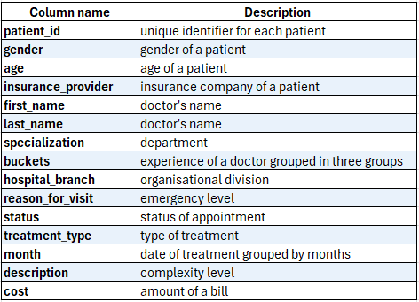
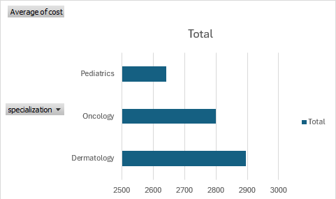
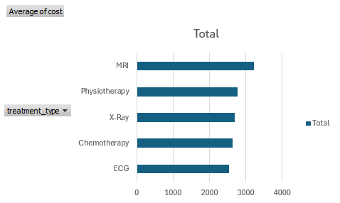
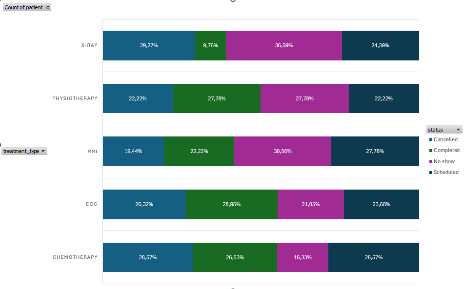
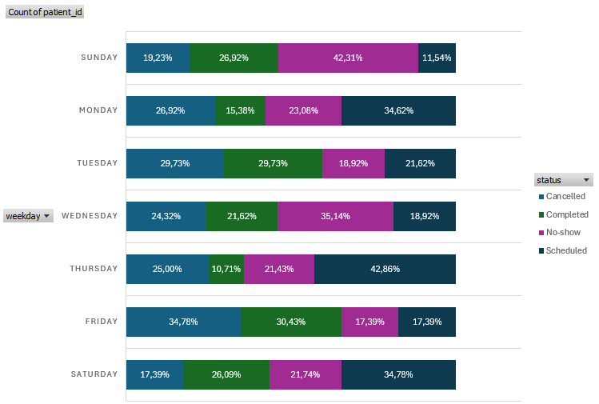
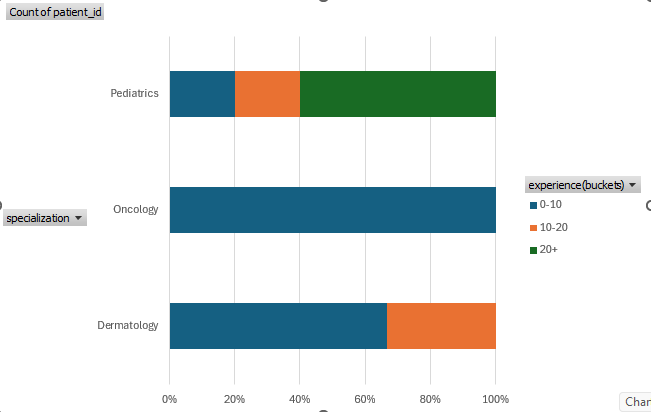
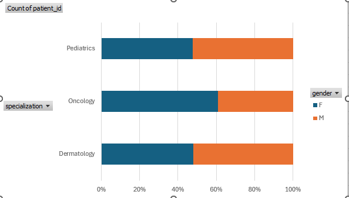
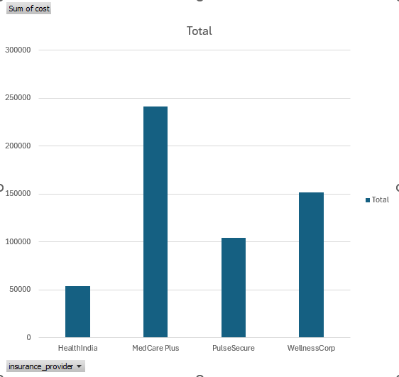

## I. Introduction / Context

### Project goal
The goal of this project is to explore and analyze the hospital management data, understand cost distribution across departments and branches, identify trends over time, and uncover insights that can inform strategic decisions for hospital management optimization.

### Content of each column

### Tools used
- **SQL**: For data cleaning, transformation, and preparation.
- **MS Excel**: For interactive dashboards, filtering, and visual exploration of the dataset.

## II. Data cleaning
To prepare the dataset for analysis, the following steps were performed:

1. **Column adjustments and renaming**
- Removed irrelevant columns like `description` and `appointment_date`.
- Renamed `specialization` to `department` and `status` to `appointment_status` for clarity.

2. **Type conversion**
- Converted `date_of_birth` and `treatment_date` to date, `cost` to numeric types.

3. **Standardization and formatting**
- Formatted `treatment_date` to short date, `cost` to integer without decimals.
- Trimmed unnecessary spaces.

4. **Feature engineering**
- Created column `age` from `date_of_birth` for clearer analysis.
- `years_experinence` put in three groups: 0-10, 11-20, 20+.
- Extracted only month from `treatment_date` for timeline chart.

5. **Resulting dataset**
- Cleaned, standardized, and structured data ready for exploratory analysis and visualization in Excel dashboard.

## III. Exploratory Data Analysis (EDA)

The cleaned hospital dataset allowed us to explore key questions about the hospital revenue, appointment distribution, and trends over time. 

Using MS Excel, interactive dashboards were created to visualize the findings.

### Distribution of cost by departments
**Question:** Which department is the most expensive?

**Observation:**
- Average cost of teratment in pediatrics is 2650. 2800 in oncology, 2900 in dermatology.

**Insight:**
- Dermatology drives a majority of revenue.
- Pricing standardization may be lacking.

### Distribution of cost by treatments
**Question:** Which treatment type is the most expensive?

**Observation:**
- Everything is pretty much standardized around 2500, just the MRI is above 3000.

**Insight:**
- Expensive MRI teratment pulls the total mean upward.

### Distribution of appointments by status, treatment and weekday
**Question:** When patients don't show at appointments mostly?

**Observation:**
- Only ECG and chemotherapy have less than 25% of no-show appointments.

**Insight:**
- X-ray an MRI have the biggest negative difference between no-show and completed appointments.
- Sunday and Wednesday are days of week when patients don't show the most.

### Staff experience
**Question:** Is there a department where there is no senior doctors?

**Observation:**
- Pediatrics department is perfectly distributed.
- Oncology have juniors only.
- Dermatology doesn't have seniors above 20 years of experience

**Insight:**
- Oncology department is at risk because of lack of experience.

### Hospital branches popularity
**Question:** Which hospital branch has most visits?

**Observation:**
- Central hospital more than 80 appointments in 2023.
- Eastside clinic around 60.
- Westside clinic around 55.

**Insight:**
- Central hospital is overloaded.
- Westside clinic is underutilized.

### Patient demographics
**Question:** Is there a department where some gender dominates?

**Observation:**
- Pediatrics and dermatology around 50% of both genders.
- 60% of female patients in oncology department.

**Insight:**
- Pediatrics and dermatology have normally distributed genders.
- Women dominates in oncology department.

### Insurance providers
**Question:** What insurance provider brings us the most of revenue?

**Observation:**
- 250k of treatment cost is from Medcare Plus.
- Just 50k of cost by HealthIndia.

**Insight:**
- Medcare Plus dominates.
- Pulse Secure and WellnessCorp are in average.
- HealthIndia is extremely low.

## IV. Recommendations
- **Implement tiered service packages** (eg. basic, standard, premium) to balance affordability and profitability.
- Build a **cost prediction model** to detect inneficiencies or overbilling.
- When the no-show rate is too large **implement:**
    - **SMS reminders** or automated confirmations
    - **Penalties** for repeat no-shows
    - Predictive analytics to **flag likely no-shows** (based on history, demographics, day of week etc.)
- Schedule **mentoring** or **second-opinion review** processes in junior-heavy departments.
- For **experience doctors**, emphasize **high-value** or **complex procedures** where experience adds the most value.
- **Increase staffing** where hospital branch is **overloaded**.
- **More marketing or service diversification** where branch is **underutilized**.
- **Target health campaign** of breast cancer screening for women.
- **Negotiate better reimbursement** contracts with insurance provider that dominates.

## V. Limitations
**- Dataset scope**
  The dataset only includes data in 2023 and may not reflect the most recent trends.
**- Viewership Data Not Included** 
  The dataset doesn't include patient metrics such as patient wwait time or hospital stay time which are important KPI metrics in healthcare.

## VI. Dashboard

